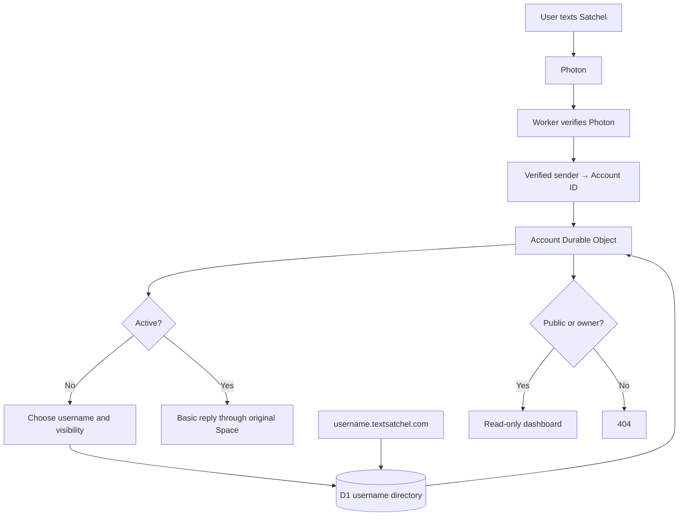
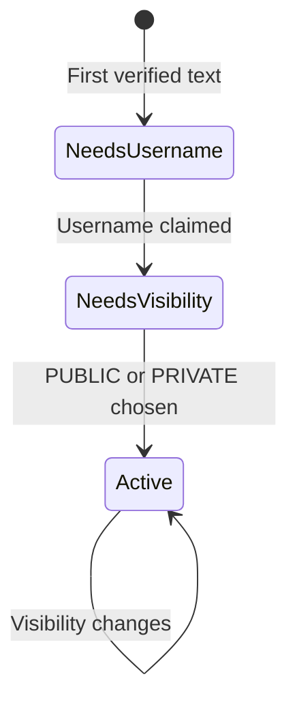

# Assignment: Secure Accounts and Dashboards for Satchel

**Role:** You write the implementation; Codex acts as teacher and reviewer.
**Starting point:** PR #9 configures Photon and PR #10 proves message send/receive.
**Goal:** A person texts Satchel, claims a username, chooses public or private visibility, and gets a read-only dashboard at `username.textsatchel.com`.

**Out of scope:** memory, attachments, groups, real model inference, and R2. Do not add them during this assignment.

## What you will learn

- Authenticate Photon events before trusting a sender.
- Derive a stable private account identity without exposing a phone number.
- Isolate account state with Durable Objects.
- Enforce unique usernames with D1.
- Give the owner private browser access without email or passwords.
- Apply Effect Schema, services, typed errors, Layers, and redacted configuration.

## Architecture

### Storage boundaries

| Component | Owns | Never stores |
|---|---|---|
| Account Durable Object | Onboarding, visibility, owner sessions, dashboard data | Another account’s data |
| D1 | Unique `username → account ID` directory | Phones, messages, tokens, memory |
| R2 | Nothing yet; attachment bytes later | Account or authentication state |

Durable Objects give each account private, transactional storage. D1 answers the global question “Who owns `alice`?” with a unique index.

## Domain primitives

- **Verified sender:** provider and sender address produced only after Photon authentication.
- **Account ID:** HMAC fingerprint of provider plus sender. Satchel computes it; requests cannot supply it.
- **Username:** normalized lowercase hostname label with length, character, and reserved-name rules.
- **Account state:** `Needs username`, `Needs visibility`, or `Active`.
- **Visibility:** `Public` or `Private`; private is the default and failure mode.
- **Conversation route:** account plus opaque Spectrum Space and serving line.
- **Owner session:** revocable browser session created from a one-time link sent to the verified phone.
- **Dashboard view:** an explicit safe-field projection. Never render the stored account object directly.

Before `Active`, send fixed onboarding messages only—no inference or tools.

## PR 1 — Trusted Worker ingress

**Question:** Can Satchel trust who sent this message?

### Your work

1. Add the Photon webhook Worker endpoint.
2. Read the raw body once; verify signature and timestamp before decoding JSON.
3. Reject stale, malformed, or incorrectly signed events.
4. Deduplicate using webhook ID plus message ID.
5. Decode with Effect Schema and accept only inbound iMessage text DMs with a sender.
6. Produce a provider-neutral verified inbound message.

Use redacted configuration for secrets, distinct tagged errors for each expected failure, and Web Crypto inside the HTTP adapter. Run the Effect only at the Worker entry point.

**Pass when:** forged requests fail, replays execute once, unknown fields do not crash the Worker, and logs contain neither phones nor message text.

## PR 2 — Account onboarding and isolation

**Question:** Which private account owns this message?

### Your work

1. Compute the Account ID with a separate identity secret; never reuse the Photon secret.
2. Route the Account ID to one Durable Object and persist state in its storage.
3. Parse usernames with a pure domain operation.
4. Claim a username by attempting a D1 insert protected by a unique constraint. “Check, wait, then claim” is not authoritative.
5. Ask the user to choose `PUBLIC` or `PRIVATE`.
6. Permit basic agent handling only after activation.
7. Bind replies to the verified inbound Spectrum Space. The user and future model output never choose the recipient.

**Pass when:** the same phone always reaches the same object; different phones never share one; simultaneous username claims have one winner; retries are idempotent; incomplete accounts cannot reach agent handling.

## PR 3 — Owner access and dashboard

**Question:** Who may read `alice.textsatchel.com`?

### Your work

1. Route wildcard subdomains to a dashboard Worker and parse exactly one valid username label.
2. Resolve the username through D1, then ask the Account Durable Object for a dashboard view.
3. Allow everyone when public; when private, require Alice’s valid owner session or return `404`.
4. When Alice texts `DASHBOARD`, send a random one-time link. Store only its hash, expire it quickly, and exchange it for a revocable secure cookie.
5. Accept only `GET` and `HEAD`, escape displayed text, expose only the dashboard projection, and do not cache pages initially.
6. Make public/private switching immediate without changing the account, username, or URL.

**Pass when:** Alice’s session cannot open Bob’s dashboard; expired and reused links fail; anonymous private requests return `404`; public pages are readable; mutation methods return `405`.

## Engineering workflow and grading rubric

For each PR: write behavioral tests first, implement pure domain decisions, add Effect services for application policy, keep Photon/Cloudflare mechanics in adapters, wire Layers at the entry point, then run lint, Effect diagnostics, typechecking, tests, and build.

Your submission must demonstrate:

- Parse external input before application logic.
- Represent expected failures with specific tagged errors.
- Wrap Promise SDK boundaries with Effect.
- Keep secrets redacted and phones/tokens/messages out of logs.
- Keep Account IDs, usernames, and Space IDs as distinct concepts.
- Let Cloudflare own persistence while Effect coordinates each invocation.
- Treat Spectrum IDs as opaque and reply through the originating Space.
- Never trust an account ID supplied by a browser or message.
- Fail closed: uncertainty produces private state, `404`, or no send.

## References

- [Photon webhook contract](https://photon.codes/docs/webhooks/events)
- [Cloudflare Durable Object storage](https://developers.cloudflare.com/durable-objects/best-practices/access-durable-objects-storage/)
- [Cloudflare D1 unique indexes](https://developers.cloudflare.com/d1/best-practices/use-indexes/)
- `.agents/skills/spectrum/`
- `agent-patterns/effect.md`

**Final security note:** Phone possession is the account authority here. It cannot defeat SIM swaps or recycled numbers. Before storing sensitive memory, treat passkey or recovery design as a separate prerequisite assignment.
